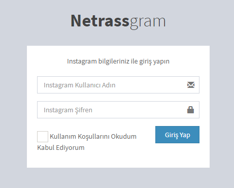
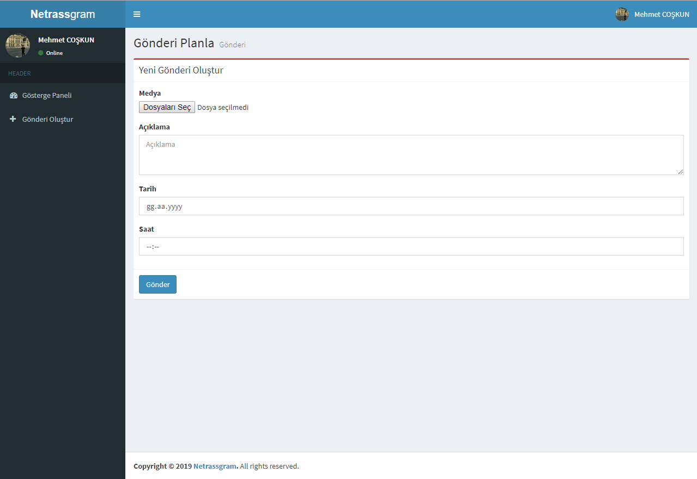
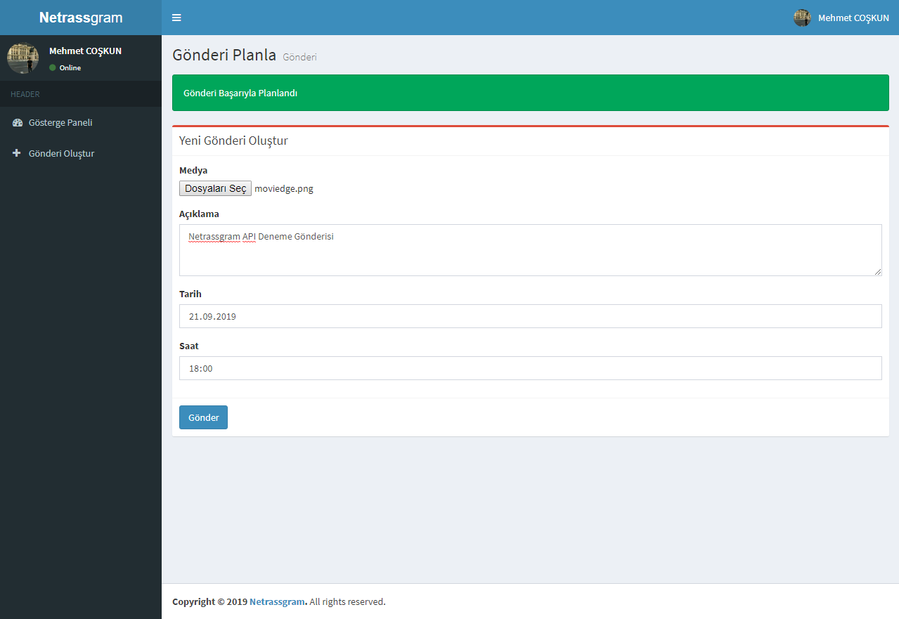
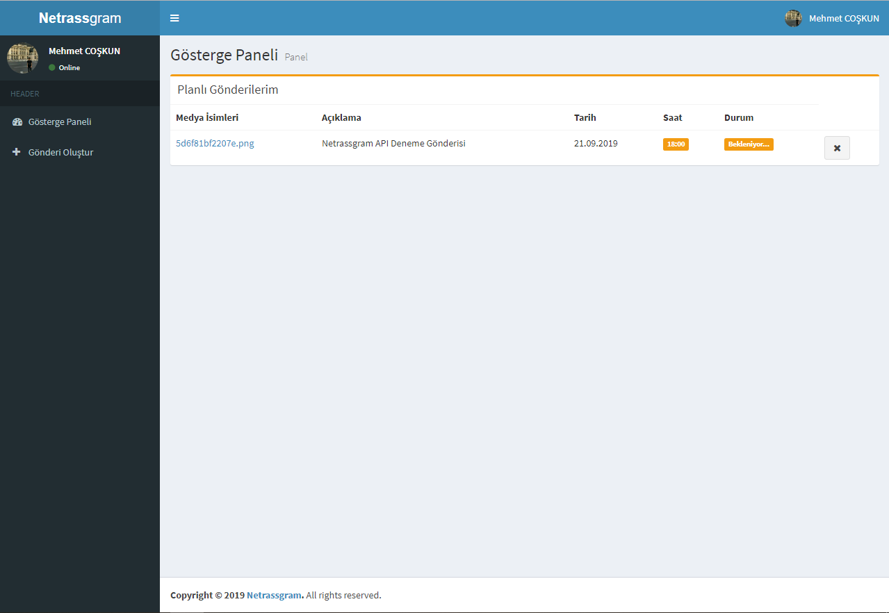

## Instagram Scheduler & Auto Post
 

## Türkçe:
Netrassgram Web Tabanlı bir Instagram zamanlama sistemidir. Instagram gönderilerinizi belirlerdiğiniz zamanda paylaşır. yönetim panelinden gönderilerinizi yönetip yeni gönderi zamanlayabilirsiniz.

## English:
Netrassgram is a Web Based Instagram timing system. It shares your Instagram posts at the time you set. You can manage your posts and schedule a new post from the management panel.

**Geliştirilmeye açıktır. (This project is open to development.)**

### Ekran Görüntüleri (Screenshots)

# Kurulum (Setup)

### Türkçe:
 - "system" klasörü içerisinde database.json dosyasını kendinize göre düzenleyin.
 - Netrassgram sınıfında bulunan 93. ve 94. satırlarlarını kendinize göre düzenleyin. (FFmpeg ve FFprobe yolunu belirtmelisiniz)
 - CPanel üzerinden cronjob ayarlarını yapın (dakikada birkez) veya [cron-job.org](https://cron-job.org/) adresinden check.php'ye istek gönderin
 - [netrassgram.sql](netrassgram.sql) dosyasını veritabanınıza aktarın.

composer kurulumunuda tamamladıktan yapmanız gereken sadece siteye giriş yapmak.

### English:
 - Edit the database.json file within the "system" folder according to your own.
 - Arrange the 93rd and 94th lines in the Netrassgram class for you. (You must specify FFmpeg and FFprobe path)
 - Set cronjob settings (once per minute) via CPanel or send a request to check.php at [cron-job.org](https://cron-job.org/)
 - Transfer the file [netrassgram.sql](netrassgram.sql) to your database.

After completing the composer installation, all you have to do is log in to the site.
